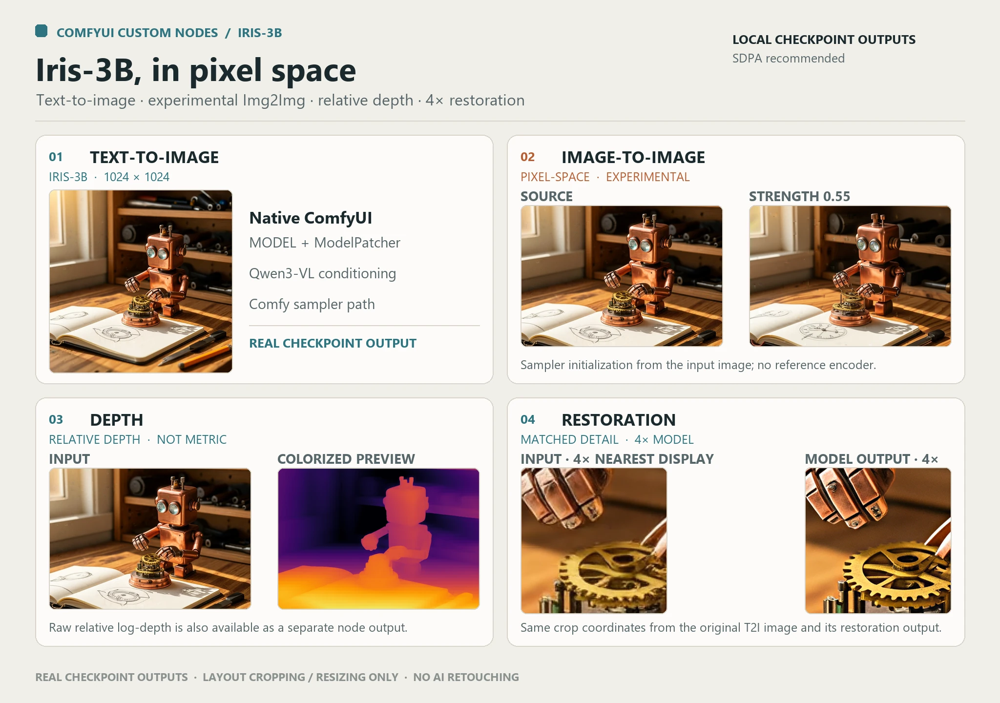

# ComfyUI-Iris

Native ComfyUI nodes for Iris-3B pixel-space text-to-image, experimental image-to-image, relative depth, and image restoration. Generation uses ComfyUI's `MODEL` / `ModelPatcher`, conditioning, RGB `LATENT`, and sampler path—no hidden `generate()` call.



## Capabilities

- **Text-to-image:** Qwen3-VL 4B through ComfyUI's standard **Load CLIP**, Iris conditioning, Iris sigmas, and native samplers.
- **Experimental pixel-space Img2Img:** initialize sampling from an input image. Iris has no official trained reference-image conditioning; the image is not a visual prompt.
- **Depth:** separate depth checkpoint with a colorized relative-depth preview and raw relative log-depth output.
- **Restoration:** separate model trained for 4× restoration, with optional final output sizing.
- **Local checkpoints:** select files already installed in ComfyUI. The extension does not download model weights during execution.

## Install

Clone the extension into `ComfyUI/custom_nodes` and install its one extension-specific dependency using the same Python environment that starts ComfyUI:

```bash
cd ComfyUI/custom_nodes
git clone https://github.com/ScryptHunter/ComfyUI-iris.git ComfyUI-Iris3B
python -m pip install -r ComfyUI-Iris3B/requirements.txt
```

For **ComfyUI Portable on Windows**, run the install command from the portable root:

```powershell
git clone https://github.com/ScryptHunter/ComfyUI-iris.git .\ComfyUI\custom_nodes\ComfyUI-Iris3B
.\python_embeded\python.exe -m pip install -r .\ComfyUI\custom_nodes\ComfyUI-Iris3B\requirements.txt
```

Restart ComfyUI. ComfyUI 0.39.0 supplies PyTorch, Transformers, Safetensors, NumPy, and Pillow; this extension adds only `omegaconf>=2.3.0`. Do not reinstall or upgrade PyTorch, CUDA, Triton, Transformers, or SageAttention for this extension.

## Models

Download weights manually from the official sources and put them in ComfyUI's model folders. No model files are included in this repository, and Iris nodes do not auto-download missing weights.

| File | Purpose | Suggested location |
|---|---|---|
| Iris base `.safetensors` from [Sperid Labs](https://huggingface.co/speridlabs/iris-3b/tree/main) | T2I / Img2Img | `models/diffusion_models/iris-3b/` |
| `depth/model.safetensors` from the [Depth export](https://huggingface.co/speridlabs/iris-3b/tree/main/depth) | Depth | `models/diffusion_models/iris-3b/depth/` |
| `upscaler/model.safetensors` from the [Upscaler export](https://huggingface.co/speridlabs/iris-3b/tree/main/upscaler) | Restoration | `models/diffusion_models/iris-3b/upscaler/` |
| Optional `empty_prompt.safetensors` from the matching task folder | Depth / restoration | Beside its task model, or select it in the loader |
| ComfyUI-compatible Qwen3-VL 4B checkpoint from [Qwen](https://huggingface.co/Qwen/Qwen3-VL-4B-Instruct) | Text conditioning | `models/text_encoders/`; load with **Load CLIP** |

Place Iris files under `models/diffusion_models/iris-3b/` (recommended) or the legacy `models/unet/iris-3b/`; the loader scans both. Select the local checkpoint in **Iris3B Model Loader** and choose its task (`t2i`, `depth`, or `upscaler`). Restart ComfyUI or refresh the UI if a newly copied file is not listed. Iris config defaults are bundled, so standard exports do not require separate `config.yaml` files. For depth and restoration, `empty_prompt=None` uses the sibling cache when available.

## Nodes and workflows

| Workflow | Use |
|---|---|
| [`iris_t2i_comfy_clip.json`](workflows/iris_t2i_comfy_clip.json) | Recommended native sampler T2I path. |
| [`iris_t2i_ksampler.json`](workflows/iris_t2i_ksampler.json) | Experimental standard KSampler compatibility; not claimed equivalent to the reference sampler. |
| [`iris_img2img_experimental.json`](workflows/iris_img2img_experimental.json) | Experimental pixel-space Img2Img using the native sampler. |
| [`iris_depth.json`](workflows/iris_depth.json) | Relative-depth preview and raw output. |
| [`iris_restoration_4x.json`](workflows/iris_restoration_4x.json) | Restore an input image. |
| [`iris_combined.json`](workflows/iris_combined.json) | T2I image branches independently to Depth and Restoration. |

The extension registers **Iris3B Model Loader**, **Iris3B Text Encode (Comfy CLIP)**, **Iris3B Empty Pixel Latent**, **Iris3B Pixel Decode**, **Iris3B Pixel Encode (low-level)**, **Iris3B Img2Img Init**, **Iris3B Sigma Scheduler**, **Iris3B Seeded Sampler Noise**, **Iris3B Depth**, and **Iris3B Restore 4x**. Workflows also use standard ComfyUI nodes such as **Load CLIP**, **CFG Guider**, **SamplerCustomAdvanced**, **Save Image**, and optionally **KSampler**.

## Img2Img behavior

Img2Img is **experimental pixel-space initialization**, not official Iris reference-image conditioning. The input image is not sent through a VAE or a text-conditioning slot. Positive and negative prompts are text-only; never connect an image to a negative prompt.

`Iris3B Img2Img Init` center-crops the input to dimensions divisible by 16 using integer slicing—no interpolation, aspect-ratio distortion, or change to retained pixels. It returns the clean pixel latent and the selected suffix of the full Iris sigma schedule. ComfyUI's `CONST` model-sampling path applies noise once:

```text
x_t = (1 - sigma_start) * x0 + sigma_start * epsilon
```

For `N` schedule intervals, positive strength selects `clamp(floor(strength * N + 0.5), 1, N)` active intervals and skips the earlier sigmas. Strength 0 is a no-op; strength 1 uses all intervals. Strength is quantized to whole steps, not a guaranteed percentage of visual change. In one local 12-step run, strength 0.25 used 3 active steps and strength 1.0 used 12; the fixed-seed 0.25 replay was identical on that machine. This is a scoped observation, not a cross-device quality or seed-parity guarantee.

## Recommended settings and limits

- **T2I reference candidate:** `SamplerCustomAdvanced`, Iris sigma schedule, `dpmpp_2m_sde`, `eta=0`, `solver_type=midpoint`, 100 steps, CFG 3, SDPA. Start around 1 megapixel (for example, 1024×1024). 512 px generation has shown visible patch/grid artifacts. These settings are a tested local starting point, not a claim of parity with every upstream sampler.
- **Img2Img:** start with strength `0.25`, SDPA, and the same native sampler settings; increase strength for more change.
- **Attention:** PyTorch SDPA is the recommended baseline. Optional SageAttention is experimental and not validated end-to-end; a randomized Sage2++ tolerance test has intermittently failed.
- **Depth:** relative, not metric. The colorized preview is for visualization; raw relative log-depth is a separate output.
- **Restoration:** the model is trained for 4×. Other output scales resample its result and do not create additional learned detail.
- **Compatibility:** tested on Windows 11 with ComfyUI 0.39.0, Python 3.13, and an RTX 4090. Linux and other ComfyUI versions are not verified. Full frontend acceptance of the current public workflows remains incomplete.
- **Memory and numerical parity:** Iris uses whole-model placement/offload. Process RSS remained elevated after repeated reloads in one local diagnostic; the retained native memory was not fully attributed. BF16 trajectory parity, Qwen strict hidden-state parity, and cross-device seed parity are not claimed.

The development regression suite most recently reported **183 passed, 7 warnings**. These are scoped local checks, not broad quality benchmarks; final API and GUI acceptance remains a separate validation gate.

## Credits and license

This extension integrates [Sperid Labs' Iris-3B](https://github.com/speridlabs/iris-3b) and [official Iris weights](https://huggingface.co/speridlabs/iris-3b), with Qwen3-VL conditioning from [Qwen](https://huggingface.co/Qwen/Qwen3-VL-4B-Instruct). Matplotlib-derived depth palette tables are documented in [`NOTICE`](NOTICE) and [`licenses/MATPLOTLIB_LICENSE.txt`](licenses/MATPLOTLIB_LICENSE.txt). The extension is Apache-2.0 licensed; model and dependency licenses remain with their providers.
